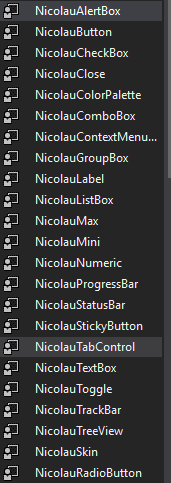
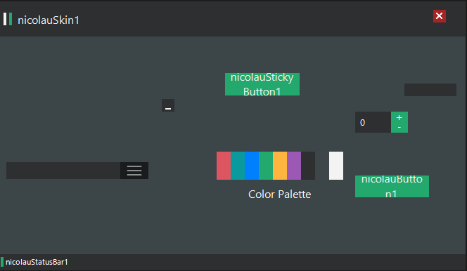

alert read
======

by weliton nicolau
======

welcome to my source of visual studio 2017 C #

I'm brazilian

anyone who wants to send corrections and reports difficulties is at ease.

to contact me.

discord weliton

NicolauHack
======
For Beginners in Using Hack for Games.

Can be used to create hack of any game.

this is the initial source to start a hack, not a hack itself, but rather just its interface ready to be added features.

goes from each one, his creativity.

welcome

Instructions
===========

Download the source code and open the project in visual studio;

after you open Make compile Project (NicolauTheme) later

to Generate (NicolauTheme.dll) from paste bin => bin\NicolauTheme.dll

drag and apply DLL NicolauTheme.dll => to Toolbox from your visual studio 2017

In the toolbox Drag NicolauSkin into your simple visual studio 2017 C#

========

NicolauHack is a C# port of the Flat UI theme released by iSynthesis, which
was written in visual studio 2017 C#

Download Source
===========
  >On GitHub, click `Clone or download`, `Download ZIP`.
  >Or run `git clone https://github.com/wtnicolau/NicolauHack.git`

Problems
===========
to compile your project must be chosen in the initial project solution
start project compiler (nicolauhack)as primary and (nicolautheme) as dependents.

Credits
-------
- iSynthesis for original code
